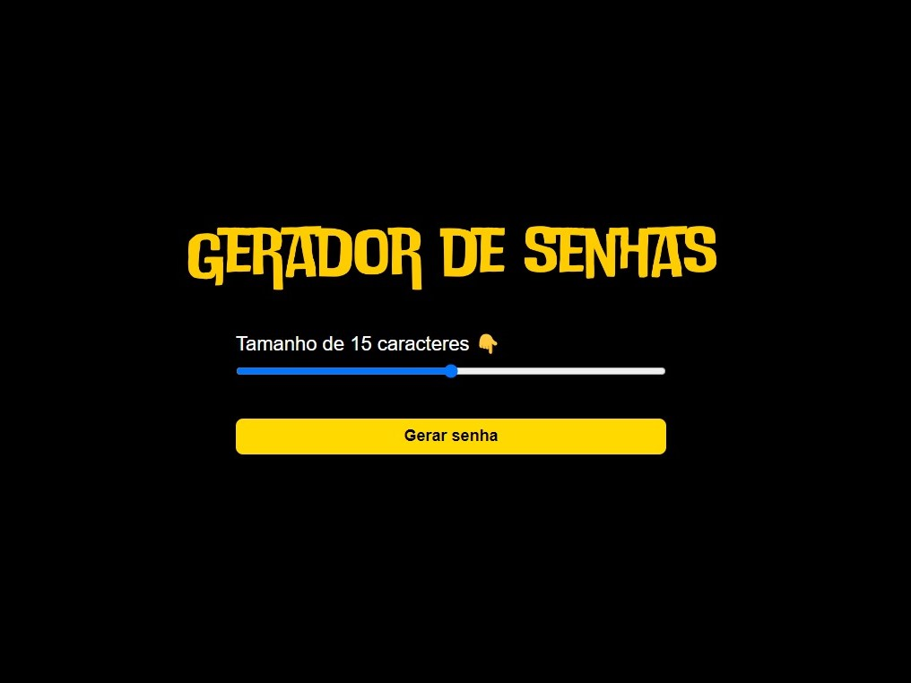
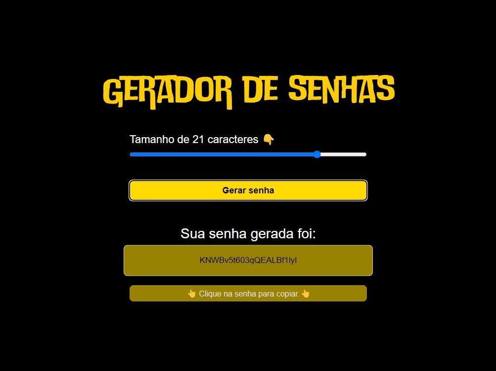

<h1 align="center"> Gerador de Senhas </h1>

Fruto de esforço e estudo pessoal.

  <a href="#-tecnologias">Tecnologias</a>&nbsp;&nbsp;&nbsp;|&nbsp;&nbsp;&nbsp;
  <a href="#-projeto">Projeto</a>&nbsp;&nbsp;&nbsp;|&nbsp;&nbsp;&nbsp;
  <a href="#-layout">Layout</a>&nbsp;&nbsp;&nbsp;|&nbsp;&nbsp;&nbsp;
  <a href="#-licença">Licença</a>&nbsp;&nbsp;&nbsp;|&nbsp;&nbsp;&nbsp;

  

 
<h2> 💻Browser panel  </h2>

## 🚀 Tecnologias

Esse projeto foi desenvolvido com as seguintes tecnologias:

- HTML e CSS
- JavaScript
- Git e Github
- Figma

## 💻 Projeto

Site para gerar senhas aleatorias de até no máximo 25 caracteres

## : Termo: Licença

Esse projeto está sob a licença MIT.

---

Feito com ♥ por Lucas Fousek
